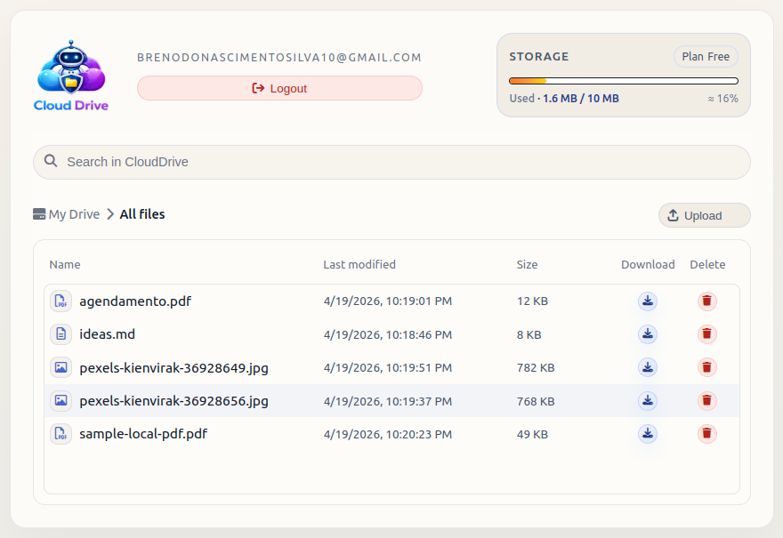

<a href="https://drive.brenodonascimento.com/" target="_blank" rel="noopener noreferrer"></a>

Live demo: <a href="https://drive.brenodonascimento.com/" target="_blank" rel="noopener noreferrer">https://drive.brenodonascimento.com/</a>

# ☁️ Cloud Drive

A clean, minimal cloud storage application that allows users to upload, view, and delete files.

This project is designed for **quick setup** — just run Terraform and open the CloudFront URL.

---

# 🚀 What This Project Creates

Terraform automatically provisions:

* 🔐 Amazon Cognito User Pool
* ⚡ Cognito App Client
* 🌐 Cognito Hosted UI
* 🎨 Cognito Hosted UI Branding
* 📦 S3 Bucket (Frontend + Storage)
* 🔑 IAM Roles & Policies
* 🌍 CloudFront Distribution
* :robot: Lambda function

---

# 📦 Prerequisites

Install:

* Terraform ≥ 1.5
* AWS CLI
* AWS Account

Verify:

```bash
terraform -v
aws configure
```

---

# 🧰 Terraform State (S3 Backend)

## Init 

Set up backend.hcl with your own values

```bash
cp infra/backend.hcl.example infra/backend.hcl
```

You must pass it during `init`.

```bash
terraform -chdir=infra init -backend-config="backend.hcl"
```

---

## 🚀 Apply

Just run:

```bash
terraform -chdir=infra apply
```

---

# 🌍 Access the Application

After Terraform finishes, it will output:

```
cloudfront_url = https://xxxxxxxx.cloudfront.net
```

Open the **CloudFront URL** in your browser.

You will automatically be:

1. Redirected to Cognito login
2. Authenticated
3. Redirected back to Cloud Drive
4. Access your dashboard

---

# 🔐 Authentication Flow

```
User
 │
 ▼
CloudFront URL
 │
 ▼
Redirect to Cognito
 │
 ▼
Login
 │
 ▼
Redirect Back
 │
 ▼
Cloud Drive App
```

---

# 🧹 Destroy Resources

To remove everything:

```bash
terraform -chdir=infra destroy
```

---
